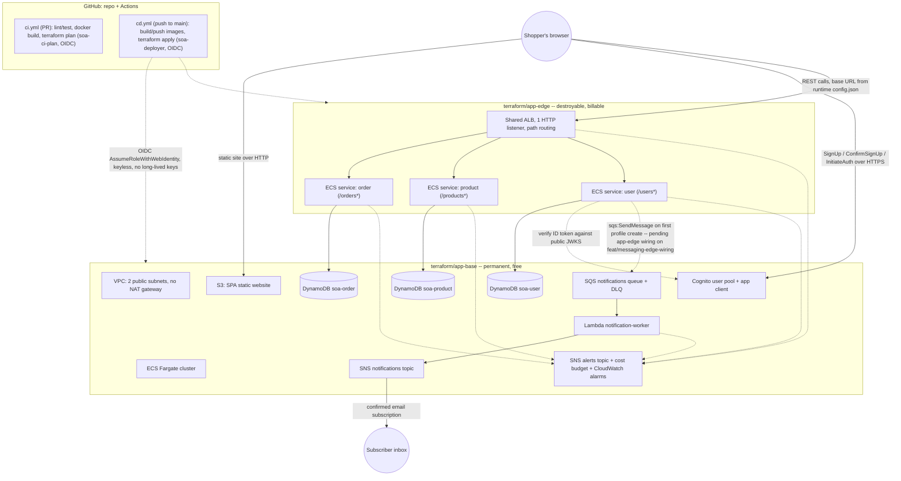

# SOA Final Project — AWS Microservices Storefront

An SOA course project: a small Amazon-style storefront built as microservices on AWS, hybridizing containers and event-driven serverless.

## What this is

Three synchronous REST microservices — **order**, **product**, **user** — run as Docker containers on **Amazon ECS (Fargate)** behind a single shared **Application Load Balancer**, each owning its own **DynamoDB** table (polyglot persistence, no shared database). Decoupled work runs on **AWS Lambda**: the user service publishes an event to **SQS**, a Lambda worker consumes it and fans out a notification via **SNS**. A React **SPA** is served as a static site from **S3**; application auth is **Amazon Cognito**, called SPA-direct over HTTPS APIs. Images are published to **ECR**, tagged by commit SHA. All infrastructure is **Terraform**, applied by a keyless (GitHub OIDC) **GitHub Actions** CI/CD pipeline — no long-lived AWS keys anywhere in the repo. The project is deliberately cost-conscious: no NAT gateway, one shared ALB, and the billable half of the infrastructure is split out so it can be torn down to ~$0 between work sessions without losing any data.

See [PROJECT REQUIREMENTS.md](PROJECT%20REQUIREMENTS.md) for the assignment brief this is built against, and [CLAUDE.md](CLAUDE.md) for the full repo conventions.

## Architecture

The picture below matches what's on `main` today. **One leg is annotated, not misrepresented:** the user service's code already publishes `UserProfileCreated` to SQS, but the `app-edge` wiring that gives it a queue URL and an `sqs:SendMessage` grant is on a separate, not-yet-merged branch — see [docs/architecture/overview.md](docs/architecture/overview.md#system-diagram) for the detail and the PRD link.



Two Terraform configs make up the billable app tier, split by lifecycle ([ADR 0003](docs/architecture/decisions/0003-base-edge-split.md)): **`terraform/app-base/`** (network, ECS cluster, every service's DynamoDB table, Cognito, the SPA's S3 bucket, the async pipeline, monitoring — permanent, free, never destroyed) and **`terraform/app-edge/`** (the ALB and every service's compute — destroyable, the only thing routine teardown targets). A separate, human-applied identity foundation (`terraform/` root) provisions the GitHub OIDC trust and the least-privilege pipeline roles once, outside the routine cycle.

Full sequence diagrams (a sync CRUD round-trip, and the async sign-up → welcome-email flow) are in [docs/architecture/overview.md](docs/architecture/overview.md#request-flow-sequences).

## Services

| Service | What it does | Docs |
| --- | --- | --- |
| **order** | Places orders, lists order history, progresses an order through its lifecycle (`PLACED → SHIPPED → DELIVERED`, or `CANCELLED`) against its own table. | [services/order/README.md](services/order/README.md) |
| **product** | An Amazon-style product catalog — list/search/filter, create/edit/delete, atomic stock adjustment. | [services/product/README.md](services/product/README.md) |
| **user** | Owns a shopper's profile and billing details, authenticated by verifying a Cognito ID token against the pool's public JWKS (no shared secret, no Cognito API call). Rejects any request carrying raw card data. | [services/user/README.md](services/user/README.md) |
| **notification-worker** (Lambda) | SQS-triggered async worker: formats a welcome message from a `UserProfileCreated` event and publishes it to SNS for email fan-out. | [functions/notification-worker/README.md](functions/notification-worker/README.md) |

All three services follow the same [service contract](.claude/rules/service-contract.md): config from the environment only, `GET /health` (fast, DB-free), one DynamoDB table each, a least-privilege ECS task role scoped to that table, and CORS for the SPA's origin.

## Quickstart

**Local development** — each service runs against [DynamoDB Local](https://docs.aws.amazon.com/amazondynamodb/latest/developerguide/DynamoDBLocal.html) via Docker Compose; no AWS account needed:

```bash
docker compose up -d dynamodb-local
docker compose up --build order product user   # ports 3000 / 3001 / 3002
```

See each service's README (linked above) for its routes and env vars, and the frontend's own [README](frontend/README.md) for running the SPA locally (`npm run dev`, Vite hot reload). Full recipes: [docs/operations/adding-a-service.md](docs/operations/adding-a-service.md) and [docs/operations/adding-a-frontend-feature.md](docs/operations/adding-a-frontend-feature.md).

**Deployment** is entirely pipeline-driven — nothing is applied by hand. Open a PR into `main`: `ci.yml` lints/tests every service and Lambda function, builds Docker images, and plans both Terraform configs as a read-only role. Merge to `main`: `cd.yml` assumes a deploy role via keyless OIDC, builds and pushes each service's image (tagged by commit SHA — never `:latest`) to ECR, applies `terraform/app-base` then `terraform/app-edge`, and rolls out the new ECS task definitions. See [docs/operations/cicd-pipeline.md](docs/operations/cicd-pipeline.md).

**Cost / teardown** — the ALB and every running Fargate task live in the destroyable half of the infrastructure. Bring spend back to ~$0 between sessions with:

```bash
terraform -chdir=terraform/app-edge destroy
```

Every service's DynamoDB data, the SPA, Cognito, and the async pipeline live in `terraform/app-base` and are untouched by this — see [docs/operations/cost-lifecycle.md](docs/operations/cost-lifecycle.md) for the full teardown/spin-up runbook.

## Documentation map

Full documentation lives under [`docs/`](docs/README.md), organized by a fixed taxonomy ([`.claude/rules/documentation.md`](.claude/rules/documentation.md)):

- [docs/architecture/overview.md](docs/architecture/overview.md) — the system's shape: network, compute, async branch, frontend, and where each piece lives in Terraform, plus the diagrams above.
- [docs/architecture/decisions/](docs/architecture/decisions/) — ADRs (immutable, numbered): [0001](docs/architecture/decisions/0001-platform-and-compute-architecture.md) ECS/Fargate vs. EKS, [0002](docs/architecture/decisions/0002-terraform-configuration-topology.md) Terraform config topology, [0003](docs/architecture/decisions/0003-base-edge-split.md) base/edge split, [0004](docs/architecture/decisions/0004-frontend-hosting.md) frontend hosting, [0005](docs/architecture/decisions/0005-cognito-auth-over-http.md) Cognito auth over HTTP.
- [docs/operations/](docs/operations/README.md) — local setup, the CI/CD pipeline, the Terraform/OIDC foundation, the compute layer, adding a service or a frontend feature, the cost/teardown runbook, and the async-messaging runbook.
- [docs/action_plan/](docs/action_plan/README.md) — every PRD (plan-of-record), organized per microservice plus a `platform/` folder, with current status.
- [docs/to-dos/README.md](docs/to-dos/README.md) — pending manual, out-of-band actions (admin IAM applies, subscription confirmations) a human still needs to do.
- [.claude/rules/](.claude/rules/) — the binding contracts this repo is built to: [`service-contract.md`](.claude/rules/service-contract.md) (what every service must do), [`action-plan.md`](.claude/rules/action-plan.md) (how PRDs work), [`documentation.md`](.claude/rules/documentation.md) (this taxonomy).

Project status: this is an active course build. [docs/action_plan/README.md](docs/action_plan/README.md) is the source of truth for what's Done vs. In Progress on any given PRD.
