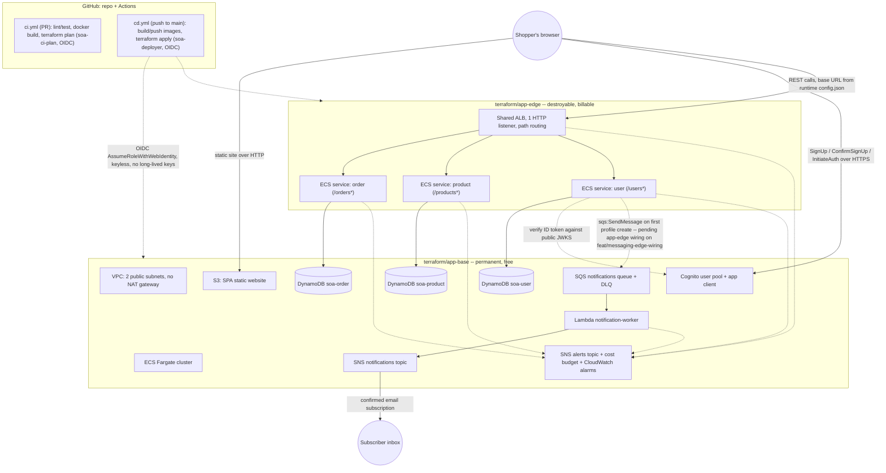
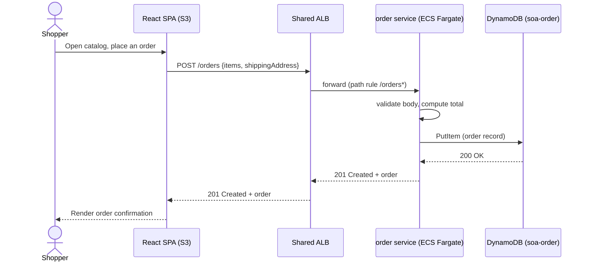
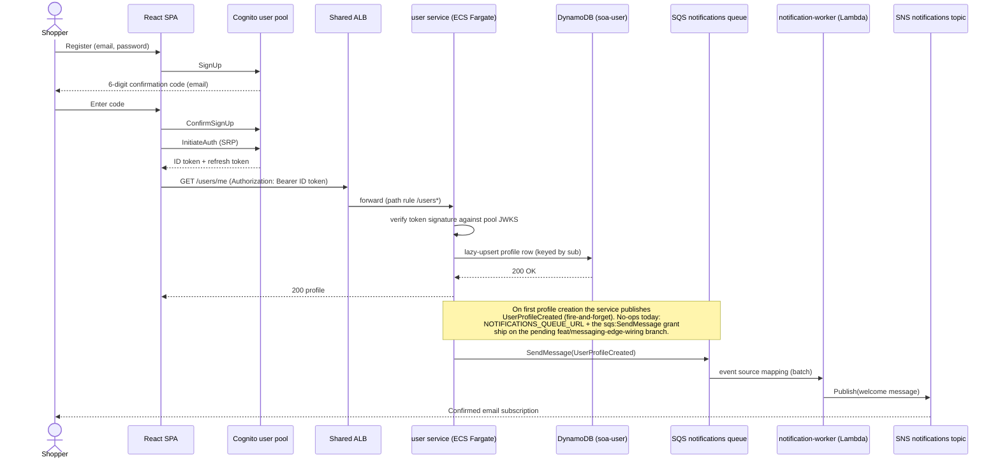

# Architecture Overview

How the system is shaped, starting from the network every workload runs in. This grows as services land — today it covers the network foundation ([PRD platform/0003](../action_plan/platform/0003-network.md)), the compute layer ([PRD platform/0004](../action_plan/platform/0004-ecs-alb.md)), and the permanent/destroyable split described below ([PRD platform/0006](../action_plan/platform/0006-base-edge-split.md), [ADR 0003](decisions/0003-base-edge-split.md)).

## System diagram

The picture below matches what's on `main` today: three ECS Fargate services (`order`, `product`, `user`) behind one ALB, each with its own DynamoDB table in `app-base`; the SPA on S3; Cognito called SPA-direct; and the SQS→Lambda→SNS notification pipeline. **One leg is not live yet** — the user service's own code already publishes `UserProfileCreated` (fire-and-forget, no-ops without a queue URL), but the `app-edge` wiring that injects `NOTIFICATIONS_QUEUE_URL` and grants its task role `sqs:SendMessage` is on the separate `feat/messaging-edge-wiring` branch, not yet merged — see [PRD platform/0008](../action_plan/platform/0008-messaging-factory.md) and [PRD platform/0011](../action_plan/platform/0011-rubric-quick-wins.md#3-scope) ("out of scope: merging `feat/messaging-edge-wiring`"). That edge is marked dotted and annotated below rather than shown as working.

## Network

One VPC, spread across **two public subnets in two Availability Zones**, with no NAT gateway:

- **Single VPC** — one network per AWS account/region for this project, sized to comfortably fit the ECS/ALB workloads planned in [ADR 0001](decisions/0001-platform-and-compute-architecture.md).
- **Two public subnets, one per AZ** — gives the ALB and ECS Fargate tasks Multi-AZ placement (resilience to a single AZ outage) without needing private subnets.
- **Public-subnet, no-NAT design** — every subnet routes `0.0.0.0/0` to an internet gateway; there are no private subnets and no NAT gateway. This is a deliberate cost trade-off, not an oversight — see [ADR 0001](decisions/0001-platform-and-compute-architecture.md#decision) ("Fargate tasks in public subnets to avoid a NAT gateway"). It means workloads placed here are internet-adjacent, so **security groups (added with each workload, not with the network) carry the access control** that a private-subnet design would otherwise get for free from network isolation.
- **Internet gateway** — the sole path in/out of the VPC.

ECS services and the shared ALB (see [ADR 0001](decisions/0001-platform-and-compute-architecture.md), and Compute below) run directly in these public subnets, reachable only through security groups scoped at the resource that needs exposure (e.g. only the ALB open to the internet; tasks reachable only from the ALB).

**Concrete values (CIDR, subnet count, AZ names) live in Terraform, not here** — see [`terraform/modules/network/`](../../terraform/modules/network/) for the resource definitions and [`terraform/app-base/main.tf`](../../terraform/app-base/main.tf) for how AZs are selected. Do not restate CIDRs/AZ names in prose; they can change without this doc needing an edit.

## Compute

Synchronous microservices run as **ECS Fargate** tasks in the public subnets above, behind a **single shared Application Load Balancer** — one ALB for every service, not one each, per [ADR 0001](decisions/0001-platform-and-compute-architecture.md)'s cost posture. The ALB's one HTTP listener routes by path: each service registers its own listener rule (e.g. `/orders*`); anything unmatched gets a fixed 404.

Each service gets its **own DynamoDB table(s)** — polyglot persistence, no shared database between services — and its **own IAM task role**, scoped to only its own table(s) and carrying the shared `soa-boundary`. A single **shared ECS task execution role** (image pull + log write only) is reused across every service, since that part is never service-specific. Task security groups only allow the app port in from the ALB's security group, so nothing reaches a task except through the load balancer.

This is built as a **paved-road module pattern**: a service is one `data` module block (its table) + one `ecs-service` module block (its ECR repo, task role, target group, listener rule, task definition, ECS service, autoscaling), on top of the shared `ecs-cluster` module (cluster + execution role + ALB security group) and `alb` module (the ALB + listener itself). As of [PRD platform/0006](../action_plan/platform/0006-base-edge-split.md) / [ADR 0003](decisions/0003-base-edge-split.md), the two module blocks for a given service **do not live in the same config** — see "Where this lives in Terraform" below. Two services now follow this pattern: `order` ([`services/order/`](../../services/order/)) was first, proving it end-to-end — a `data` table block in `app-base` and an `ecs-service` block in `app-edge` (ALB route `/orders*`, listener priority 100), deployed by the pipeline ([PRD order/0001](../action_plan/order/0001-service-scaffold.md), Done). `product` ([`services/product/`](../../services/product/)) is the second, the identical shape over a different entity (ALB route `/products*`, listener priority 110) — see [PRD product/0001](../action_plan/product/0001-service-scaffold.md) for its scope and current status. Copy either's shape for the next service (listener priority 120 is the next free value — check `terraform/app-edge/main.tf` for the current highest), and land a service's code and both of its Terraform blocks in one PR, per the lesson recorded in [order/0001's Outcome](../action_plan/order/0001-service-scaffold.md#deviation-from-plan--terraform-dropped-then-restored). See [operations/compute-layer.md](../operations/compute-layer.md) for how the cluster/roles/pipeline work, and [operations/adding-a-service.md](../operations/adding-a-service.md) for the recipe to add another service — concrete resource shapes and inputs live in [`terraform/modules/ecs-cluster/`](../../terraform/modules/ecs-cluster/), [`terraform/modules/alb/`](../../terraform/modules/alb/), [`terraform/modules/ecs-service/`](../../terraform/modules/ecs-service/), and [`terraform/modules/data/`](../../terraform/modules/data/), not restated here.

## Async / event-driven

The event-driven half of the hybrid architecture ([ADR 0001](decisions/0001-platform-and-compute-architecture.md)) is no longer aspirational — it's built: a reusable SQS (+ dead-letter queue) → Lambda → SNS "messaging factory" (`terraform/modules/messaging/`, `terraform/modules/lambda/`), wired once as a concrete notifications pipeline in **`app-base`** (permanent, free — same reasoning as the rest of `app-base`, see [ADR 0003](decisions/0003-base-edge-split.md)). Its first producer is the **user service**, which publishes a `UserProfileCreated` event to the queue on a user's first profile creation; the Lambda worker formats a welcome message and fans it out via SNS to a confirmed email subscription. See [operations/async-messaging.md](../operations/async-messaging.md) for the full shape, event contract, deploy path, and operating procedure, and [PRD platform/0008](../action_plan/platform/0008-messaging-factory.md) for the plan.

## Frontend

The demo React SPA ([`frontend/`](../../frontend/)) — a Part 4 "showcase" asset, beyond the graded backend rubric — is hosted as an **S3 static website over plain HTTP**, per [ADR 0004](decisions/0004-frontend-hosting.md). It is provisioned by [`terraform/modules/frontend/`](../../terraform/modules/frontend/), wired into **`app-base`** (not `app-edge`) — permanent and free, so it stays reachable across every routine `app-edge` teardown/spin-up cycle; only its backend API calls degrade gracefully while the edge is down.

The SPA never hardcodes the backend's API URL. It fetches a runtime `/config.json` object once at startup (`src/lib/config.ts`, awaited before render in `src/main.tsx`); backend `cd.yml` rewrites that file on S3 with the live ALB DNS after every `app-edge` apply, and `frontend-cd.yml` (the frontend's own build+deploy workflow) excludes `config.json` from its sync so a frontend-only deploy never clobbers the live URL. See [ADR 0004](decisions/0004-frontend-hosting.md) for the full reasoning, and [operations/adding-a-frontend-feature.md](../operations/adding-a-frontend-feature.md) for how a page/feature is added.

**HTTPS (CloudFront + a custom domain) remains deferred** to one later, coherent PRD — an HTTPS-served page cannot call today's HTTP-only ALB (mixed content). **Application auth, however, is no longer deferred:** per [ADR 0005](decisions/0005-cognito-auth-over-http.md), the HTTPS-redirect-URI requirement belongs only to Cognito's hosted UI, not to Cognito's `SignUp`/`ConfirmSignUp`/`InitiateAuth` APIs — so the SPA authenticates **SPA-direct** against a Cognito user pool + public app client (`terraform/modules/cognito/`, wired into `app-base`, permanent and free), calling those APIs from a custom login UI with no hosted UI and no redirect URIs. The pool/client ids are non-secret and reach the SPA through the same runtime `config.json` seam described above.

## Request-flow sequences

Two representative flows through the system above: a synchronous CRUD round-trip, and the asynchronous sign-up/notification path.

**Sync: placing an order.** The SPA never talks to DynamoDB directly — every write goes through the owning service's own table, per the compute layer's polyglot-persistence rule.

**Async: sign-up to welcome email.** Registration and login are SPA-direct against Cognito (no hosted UI); the service itself never sees a password and never calls a Cognito API — it only verifies the ID token's signature against the pool's public JWKS. The last hop (user service → SQS) is annotated because it is not wired on `main` yet — see the note under "System diagram" above.

## No hardcoded endpoints (project-wide convention)

Because the ALB is recreated on every teardown/spin-up cycle (see "Where this lives in Terraform" below), its DNS name is not stable across sessions. Every consumer — the React frontend (see Frontend above), and any service-to-service call — **reads the API base URL from config/env, never a literal ALB DNS name, IP, or endpoint in source**. This is a binding rule in [`service-contract.md`](../../.claude/rules/service-contract.md)'s application contract, enforced by a CI-visible grep for `elb.amazonaws.com` in `services/`/`functions/` (and, for the frontend, `frontend/src/`). It also makes a future stable domain (Route 53 custom domain, deferred — see [PRD platform/0006](../action_plan/platform/0006-base-edge-split.md) §3 out-of-scope) a one-value config change rather than a source change once it lands.

## Where this lives in Terraform

Per [ADR 0002](decisions/0002-terraform-configuration-topology.md) and refined by [ADR 0003](decisions/0003-base-edge-split.md), the network and compute layer are now split across **two** billable, pipeline-applied configs by lifecycle — not the single `terraform/app/` config ADR 0002 originally described (retired):

- **`terraform/app-base/`** — the network, the ECS cluster, the shared execution role, the ALB security group, and **every service's DynamoDB table**. Free, permanent, never destroyed.
- **`terraform/app-edge/`** — the ALB + HTTP listener, and every service's `ecs-service` module (compute). Destroyable, billable (~$16/mo ALB + Fargate task cost while running); this is what routine `terraform destroy` targets.

Neither config is the human-applied identity foundation in `terraform/` root. See [PRD platform/0003](../action_plan/platform/0003-network.md) §5 and [PRD platform/0004](../action_plan/platform/0004-ecs-alb.md) §5 for the original resource-by-resource cost breakdowns, [PRD platform/0006](../action_plan/platform/0006-base-edge-split.md) §5 for the split's cost table, and [operations/cost-lifecycle.md](../operations/cost-lifecycle.md) for the teardown/spin-up procedure.

## Related docs

- [ADR 0001 — Platform & Compute Architecture](decisions/0001-platform-and-compute-architecture.md) — why ECS/Fargate + public subnets over EKS/private networking.
- [ADR 0002 — Terraform Configuration Topology](decisions/0002-terraform-configuration-topology.md) — why the network and compute layer live in a separate, destroyable config, apart from the identity foundation.
- [ADR 0003 — Base/Edge Split](decisions/0003-base-edge-split.md) — why that billable config is itself split into a permanent `app-base` and a destroyable `app-edge`.
- [ADR 0004 — Frontend Hosting](decisions/0004-frontend-hosting.md) — why the SPA is S3-hosted over HTTP with a runtime `config.json`, and why HTTPS is deferred (narrowed by ADR 0005 on Cognito auth).
- [ADR 0005 — Cognito Auth, SPA-Direct, Over HTTP](decisions/0005-cognito-auth-over-http.md) — why application auth is SPA-direct Cognito over HTTPS APIs (no hosted UI), without waiting for the deferred HTTPS PRD.
- [PRD platform/0003 — Network Foundation](../action_plan/platform/0003-network.md) — the plan and outcome for the network resources described above.
- [PRD platform/0004 — ECS + ALB](../action_plan/platform/0004-ecs-alb.md) — the plan and outcome for the compute layer and golden-path modules.
- [PRD platform/0006 — Base/Edge Split](../action_plan/platform/0006-base-edge-split.md) — the plan and outcome for the base/edge split.
- [PRD platform/0008 — Async Messaging Factory](../action_plan/platform/0008-messaging-factory.md) — the plan and outcome for the SQS → Lambda → SNS notification pipeline described above.
- [PRD platform/0011 — Rubric Quick Wins](../action_plan/platform/0011-rubric-quick-wins.md) — the plan behind this doc's diagrams, the root `README.md`, the CI service-test step, and the CloudWatch alarms/cost budget.
- [PRD frontend/0001 — SPA Scaffold + S3 Hosting](../action_plan/frontend/0001-spa-scaffold-and-hosting.md) — the plan and outcome for the frontend described above.
- [operations/compute-layer.md](../operations/compute-layer.md) — how the cluster, ALB, IAM roles, and pipeline deploy work.
- [operations/async-messaging.md](../operations/async-messaging.md) — the async branch runbook: shape, event contract, deploy path, DLQ, manual gates.
- [operations/adding-a-service.md](../operations/adding-a-service.md) — the recipe for wiring a new service onto the compute layer.
- [operations/adding-a-frontend-feature.md](../operations/adding-a-frontend-feature.md) — the recipe for adding a page/feature to the SPA.
- [operations/cicd-pipeline.md](../operations/cicd-pipeline.md) — how the pipeline applies `app-base` and `app-edge`.
- [operations/cost-lifecycle.md](../operations/cost-lifecycle.md) — the teardown/spin-up procedure.
